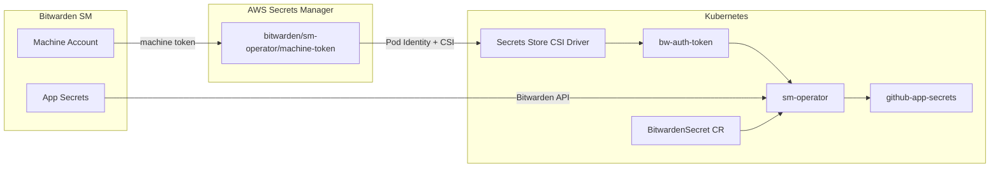

## Bitwarden Secrets Manager on EKS – End-to-End Integration

Sync secrets from Bitwarden Secrets Manager into Kubernetes on EKS using the sm-operator, AWS Secrets Manager for the machine token, and the Secrets Store CSI Driver. This guide walks through Terraform, manifests, Argo CD, validation, and force-sync procedures.

> **Note:** Use placeholder values for org IDs and secret IDs. Never commit real tokens. For production, follow least-privilege IAM and rotation practices.

---

### 1. Overview

**What this guide does:**

- Integrates Bitwarden Secrets Manager with EKS via sm-operator, AWS Secrets Manager, and Secrets Store CSI Driver
- Stores machine token in AWS Secrets Manager; CSI Driver mounts it; sm-operator syncs Bitwarden secrets into K8s Secrets
- Walks through Terraform (EKS + secret), flat manifests, Argo CD Application, validation, and force-sync

---

### 2. Prerequisites

- EKS cluster with **Secrets Store CSI Driver** installed
- **Argo CD** installed
- Terraform-managed EKS (e.g. terraform-aws-eks-basic or equivalent)
- Bitwarden Secrets Manager organization with Machine Account

---

### 3. Architecture Overview



**Flow:**

- Machine token stored in AWS Secrets Manager as `{"token":"<value>"}`
- CSI Driver mounts it into a pod; creates K8s Secret `bw-auth-token`
- sm-operator uses `bw-auth-token` to auth to Bitwarden API and sync secrets into `github-app-secrets` (or your chosen output secret)

---

### 4. Bitwarden Setup

1. **Machine Account and token:** Bitwarden Admin → Machine Accounts → Create Access Token. Copy the token.
2. **App secrets:** In Bitwarden Secrets Manager, create the secrets your apps need (e.g. `github-app-id`, `github-app-key`, `github-app-webhook-secret`, `github-app-installation-id`).
3. **Copy IDs:** From Bitwarden Admin → Settings → Organization, copy `organizationId`. For each secret, copy its `bwSecretId` (UUID).

---

### 5. Terraform

**Requirement:** EKS module must enable Secrets Manager with Pod Identity for `sm-operator-system` / `awssm-sync` and secret prefix `bitwarden/sm-operator`.

Create the AWS Secrets Manager secret and pass the token via `-var` or `TF_VAR_bitwarden_sm_machine_token`. Never commit it.

```hcl
variable "bitwarden_sm_machine_token" {
  description = "Bitwarden SM machine token from Machine Account → Create Access Token"
  type        = string
  default     = "REPLACE_WITH_REAL_TOKEN"
  sensitive   = true
}

resource "aws_secretsmanager_secret" "bitwarden_sm_token" {
  name        = "bitwarden/sm-operator/machine-token"
  description = "Bitwarden Secrets Manager machine token for sm-operator"
  tags        = var.tags
}

resource "aws_secretsmanager_secret_version" "bitwarden_sm_token" {
  secret_id     = aws_secretsmanager_secret.bitwarden_sm_token.id
  secret_string = jsonencode({ token = var.bitwarden_sm_machine_token })
}
```

---

### 6. Deploy sm-operator

Save as `sm-operator.yaml` and apply. Replace placeholders in BitwardenSecret; adjust `region` if needed.

```yaml
# Namespace for sm-operator and CSI resources
apiVersion: v1
kind: Namespace
metadata:
  name: sm-operator-system
  labels:
    name: sm-operator-system
    app.kubernetes.io/name: sm-operator
---
# ServiceAccount with Pod Identity for AWS Secrets Manager access
apiVersion: v1
kind: ServiceAccount
metadata:
  name: awssm-sync
  namespace: sm-operator-system
  annotations:
    argocd.argoproj.io/sync-wave: "-2"
---
# Fetches machine token from AWS SM and creates K8s Secret bw-auth-token
apiVersion: secrets-store.csi.x-k8s.io/v1
kind: SecretProviderClass
metadata:
  name: bitwarden-sm-token
  namespace: sm-operator-system
  annotations:
    argocd.argoproj.io/sync-wave: "-1"
spec:
  provider: aws
  parameters:
    region: ap-southeast-2
    usePodIdentity: "true"
    objects: |
      - objectName: "bitwarden/sm-operator/machine-token"
        objectType: "secretsmanager"
        jmesPath:
          - path: token
            objectAlias: token
  secretObjects:
    - secretName: bw-auth-token
      type: Opaque
      data:
        - objectName: token
          key: token
---
# Pod that triggers CSI mount; creates bw-auth-token used by sm-operator
apiVersion: apps/v1
kind: Deployment
metadata:
  name: bw-auth-token-sync
  namespace: sm-operator-system
  annotations:
    argocd.argoproj.io/sync-wave: "-1"
  labels:
    app: bw-auth-token-sync
spec:
  replicas: 1
  selector:
    matchLabels:
      app: bw-auth-token-sync
  template:
    metadata:
      labels:
        app: bw-auth-token-sync
    spec:
      serviceAccountName: awssm-sync
      containers:
        - name: pause
          image: registry.k8s.io/pause:3.9
          resources:
            requests:
              cpu: 1m
              memory: 4Mi
          volumeMounts:
            - name: secrets-store
              mountPath: "/mnt/secrets-store"
              readOnly: true
      volumes:
        - name: secrets-store
          csi:
            driver: secrets-store.csi.k8s.io
            readOnly: true
            volumeAttributes:
              secretProviderClass: bitwarden-sm-token
---
# Maps Bitwarden secrets to github-app-secrets K8s Secret
apiVersion: k8s.bitwarden.com/v1
kind: BitwardenSecret
metadata:
  name: bitwarden-secret
  namespace: sm-operator-system
spec:
  organizationId: "REPLACE_ORG_ID"
  secretName: github-app-secrets
  onlyMappedSecrets: true
  map:
    - secretKeyName: github-app-id
      bwSecretId: "REPLACE_SECRET_ID_1"
    - secretKeyName: github-app-key
      bwSecretId: "REPLACE_SECRET_ID_2"
    - secretKeyName: github-app-webhook-secret
      bwSecretId: "REPLACE_SECRET_ID_3"
    - secretKeyName: github-app-installation-id
      bwSecretId: "REPLACE_SECRET_ID_4"
  authToken:
    secretName: bw-auth-token
    secretKey: token
---
# Argo CD Application; deploys sm-operator Helm chart
apiVersion: argoproj.io/v1alpha1
kind: Application
metadata:
  name: sm-operator
  namespace: argocd
spec:
  project: platform
  source:
    repoURL: https://charts.bitwarden.com/
    chart: sm-operator
    targetRevision: 2.0.0
    helm:
      values: |
        settings:
          bwSecretsManagerRefreshInterval: 300
          cloudRegion: US
          replicas: 1
  destination:
    server: https://kubernetes.default.svc
    namespace: sm-operator-system
  syncPolicy:
    automated:
      prune: true
      selfHeal: true
  syncOptions:
    - CreateNamespace=true
```

---

### 7. Validation

After Argo CD syncs the app:

```bash
# BitwardenSecret status
kubectl get bitwardensecret -n sm-operator-system
kubectl get bitwardensecret bitwarden-secret -n sm-operator-system \
  -o jsonpath='{.status.conditions[?(@.type=="SuccessfulSync")].status}'

# Output secret keys
kubectl get secret github-app-secrets -n sm-operator-system \
  -o jsonpath='{.data}' | jq -r 'keys[]'
```

Expected: `SuccessfulSync` status `True` and the mapped keys listed.

---

### 8. Force Sync (Token Refresh)

When the machine token in AWS Secrets Manager changes:

```bash
kubectl delete secret bw-auth-token -n sm-operator-system
kubectl delete pod -n sm-operator-system -l app=bw-auth-token-sync --force --grace-period=0
kubectl wait --for=condition=ready pod -l app=bw-auth-token-sync -n sm-operator-system --timeout=60s
kubectl rollout restart deployment/sm-operator-controller-manager -n sm-operator-system
```

When only BitwardenSecret mapping changes (e.g. new secrets):

```bash
kubectl delete bitwardensecret bitwarden-secret -n sm-operator-system
# Argo CD recreates it; wait for sync
kubectl annotate bitwardensecret bitwarden-secret -n sm-operator-system \
  force-reconcile="$(date +%s)" --overwrite
```

---

### 9. Summary: Copy-Paste

**Validation (after sync):**

```bash
kubectl get bitwardensecret -n sm-operator-system
kubectl get bitwardensecret bitwarden-secret -n sm-operator-system \
  -o jsonpath='{.status.conditions[?(@.type=="SuccessfulSync")].status}'
kubectl get secret github-app-secrets -n sm-operator-system -o jsonpath='{.data}' | jq -r 'keys[]'
```

**Force sync (machine token changed):**

```bash
kubectl delete secret bw-auth-token -n sm-operator-system
kubectl delete pod -n sm-operator-system -l app=bw-auth-token-sync --force --grace-period=0
kubectl wait --for=condition=ready pod -l app=bw-auth-token-sync -n sm-operator-system --timeout=60s
kubectl rollout restart deployment/sm-operator-controller-manager -n sm-operator-system
```

**Force sync (BitwardenSecret mapping changed):**

```bash
kubectl delete bitwardensecret bitwarden-secret -n sm-operator-system
kubectl annotate bitwardensecret bitwarden-secret -n sm-operator-system force-reconcile="$(date +%s)" --overwrite
```

---

### 10. Troubleshooting

**Issue:** Has an invalid identifier

**Solution:** One or more `bwSecretId` UUIDs are wrong. Verify each ID in Bitwarden Secrets Manager.

**Issue:** CSI secret not created

**Solution:** Check Pod Identity for SA `awssm-sync` in `sm-operator-system`; ensure SecretProviderClass and `bw-auth-token-sync` pod exist. Check CSI driver logs: `kubectl logs -n kube-system -l app=csi-secrets-store`.

**Issue:** No changes / Skipping sync

**Solution:** Delete the BitwardenSecret; Argo recreates it and the operator performs a fresh reconcile.

---

### 11. References

- [Bitwarden SM Operator](https://bitwarden.com/help/secrets-manager-kubernetes-operator/)
- [Secrets Store CSI Driver](https://secrets-store-csi-driver.sigs.k8s.io/)
