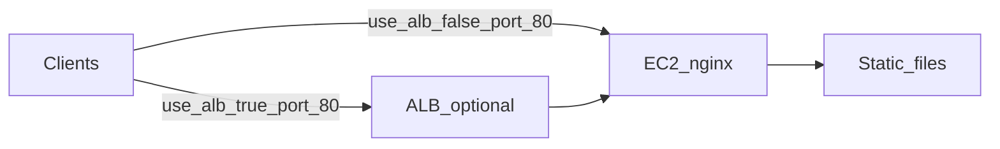

## Host a Static Site on EC2 with Terraform (VPC, Optional ALB, Session Manager)

For most static sites, **Amazon S3 with CloudFront** is cheaper, simpler, and scales better. This article is for when EC2 still fits your story—and it points you at a **ready-to-apply Terraform demo**. The snippets below are **short excerpts** from **`main.tf`**, **`variables.tf`**, **`iam.tf`**, and **`user_data.tftpl`** in that repo; clone it for listeners, target attachments, NAT, and the rest of the graph.

**Code:** [tf-aws-ec2-static-demo](https://github.com/jdevto/tf-aws-ec2-static-demo) (clone locally from the same layout under `~/workspace/jdevto/tf-aws-ec2-static-demo` if you develop beside this blog repo).

For a Terraform-first static site on **S3 + CloudFront**, see [art0018 in this blog repo](https://github.com/jdevto/blog/blob/main/articles/art0018.md) (or your published dev.to URL once you cross-link).

---

### 1. Overview

- **Demo repo** provisions **EC2** (Amazon Linux 2023) with **nginx**, **`index.html`** (shows **AZ + private IP** from IMDSv2), and **`robots.txt`**. With **`use_alb = false`**: **one** instance in **one public** subnet (direct **:80**). With **`use_alb = true`**: **`az_count` instances**, each in its own **private** subnet / **AZ**, behind an **ALB** in **`az_count` public** subnets, plus **NAT** for outbound traffic.
- **`enable_ssm = true` (default):** an **IAM instance profile** with **`AmazonSSMManagedInstanceCore`** so you can open a shell with **AWS Systems Manager Session Manager**—**no SSH key** and **no TCP port 22** in the security group.
- **`use_alb = false` (default):** you reach **port 80 on the instance** (from a CIDR you control, default open to the world for lab use).
- **`use_alb = true`:** an **internet-facing ALB** in **public** subnets; **`az_count` EC2 instances** in matching **private** subnets (**one per AZ**), all in one target group; **no public IPv4** on instances; **NAT** cost applies; instance security group allows **:80** from the **ALB security group** (forwarded traffic) and from the **VPC CIDR** (so **ALB health checks** reliably reach **nginx** on **80**). The target group health check is **HTTP** on **`/`**, matcher **200**, with **15s** interval and **10s** timeout (see repo **README** for the exact settings).

**Snippet — subnet/instance count and `az_count` validation** (`main.tf` / `variables.tf`):

```hcl
locals {
  subnet_count   = var.use_alb ? var.az_count : 1
  instance_count = var.use_alb ? var.az_count : 1
}
```

```hcl
variable "az_count" {
  default = 3
  # ...
  validation {
    condition     = var.az_count >= 1 && var.az_count <= 6 && (!var.use_alb || var.az_count >= 2)
    error_message = "az_count must be between 1 and 6, and at least 2 when use_alb is true (ALB requirement)."
  }
}
```

---

### 2. Why EC2 anyway?

Honest reasons people still do this:

- **Learning:** You want Terraform + EC2 + VPC + optional ELB in one small repo.
- **Policy or architecture:** Some orgs restrict public S3 websites or want everything inside a **VPC** next to other instances.
- **Stepping stone:** Lift-and-shift or a temporary host before moving assets to object storage + CDN.
- **Same box later:** You might add dynamic behavior on the same instance (not recommended for high scale, but it happens).

None of that makes EC2 the default best choice for a **pure** static site—only a **valid** choice in context.

---

### 3. VPC and EC2: you cannot skip the VPC

**Every EC2 instance runs in a VPC.** [EC2-Classic](https://aws.amazon.com/ec2/faqs/#ec2-classic) is gone for new accounts; there is no “VPC-less” instance. You always choose (or default to) a **subnet**, and that subnet lives in a **VPC** with **routing** (here, a public route to an **internet gateway** so the instance can run `dnf` / `yum` and serve HTTP).

The demo makes that explicit: it creates a small VPC with **public subnets** (and **private** subnets plus **NAT** when you enable the ALB) instead of using the account default VPC.

---

### 4. Architecture



With **`use_alb = false`**, clients talk to the instance’s **public IP** on **80**. With **`use_alb = true`**, clients use the **ALB DNS name** only; the stack creates **`az_count`** **public** subnets (ALB) and **`az_count`** **private** subnets with **one EC2 each**, so capacity is spread across **AZs** the same way **`az_count`** is set. You need **`az_count` ≥ 2** for an ALB; default **3** is a typical multi-AZ layout. **NAT Gateway** billing applies. Refreshing **`curl`** against the ALB can show **different AZ / private IP** in **`index.html`** as traffic moves between targets.

**AZ and private IP on the page (and why it matters for the ALB):** **`user_data`** reads **IMDSv2** for **`placement/availability-zone`** and **`local-ipv4`** and writes both into **`index.html`**. That identifies which **backend** served the response. With **one instance per AZ** behind the ALB, repeated **`curl`** to the load balancer can surface **different AZ and private IP** values as requests hit different targets—clearer proof of **multi-AZ load balancing** than a single instance.

**Snippet — IMDSv2 token then metadata** (later in the same **`user_data.tftpl`**, after **nginx** is installed):

```bash
IMDS_TOKEN=$(curl -sS -X PUT "http://169.254.169.254/latest/api/token" \
  -H "X-aws-ec2-metadata-token-ttl-seconds: 21600")
PRIVATE_IP=$(curl -sS -H "X-aws-ec2-metadata-token: $IMDS_TOKEN" \
  "http://169.254.169.254/latest/meta-data/local-ipv4")
AZ=$(curl -sS -H "X-aws-ec2-metadata-token: $IMDS_TOKEN" \
  "http://169.254.169.254/latest/meta-data/placement/availability-zone")
```

**Snippet — where each instance lands and how bootstrap is wired** (`main.tf`):

```hcl
resource "aws_instance" "web" {
  count = local.instance_count

  subnet_id              = var.use_alb ? aws_subnet.private[count.index].id : aws_subnet.public[0].id
  vpc_security_group_ids = [aws_security_group.instance.id]
  user_data              = templatefile("${path.module}/user_data.tftpl", { enable_ssm = var.enable_ssm })
  user_data_replace_on_change = true
  iam_instance_profile   = var.enable_ssm ? aws_iam_instance_profile.ssm[0].name : null
  # ...
}
```

**Snippet — instance security group when `use_alb` is true, plus target group health check** (`main.tf`):

```hcl
dynamic "ingress" {
  for_each = var.use_alb ? [1] : []
  content {
    description     = "HTTP from ALB security group (forwarded client traffic)"
    from_port       = 80
    to_port         = 80
    protocol        = "tcp"
    security_groups = [aws_security_group.alb[0].id]
  }
}

dynamic "ingress" {
  for_each = var.use_alb ? [1] : []
  content {
    description = "HTTP from VPC for ALB health checks and internal probes"
    from_port   = 80
    to_port     = 80
    protocol    = "tcp"
    cidr_blocks = [aws_vpc.main.cidr_block]
  }
}
```

```hcl
resource "aws_lb_target_group" "web" {
  count = var.use_alb ? 1 : 0

  port             = 80
  protocol         = "HTTP"
  protocol_version = "HTTP1"
  # ...

  health_check {
    enabled             = true
    protocol            = "HTTP"
    port                = "traffic-port"
    path                = "/"
    matcher             = "200"
    interval            = 15
    timeout             = 10
    healthy_threshold   = 2
    unhealthy_threshold = 3
  }
}
```

---

### 5. Session Manager (default)

**Session Manager** needs the **SSM Agent** running on the instance and **`AmazonSSMManagedInstanceCore`** on the **instance profile**. The demo uses **`user_data.tftpl`** (via **`templatefile`**) so the script starts at **column 0** with a valid **`#!/bin/bash`**—an indented Terraform **`heredoc` often breaks the shebang**, so **cloud-init never runs your bootstrap** and SSM stays **Offline** even with a correct IAM role. When **`enable_ssm`** is true, the template installs the **official SSM Agent RPM from the AWS S3 URL** (more reliable than repo-only **`dnf install amazon-ssm-agent`** on some AL2023 AMIs) and **starts** **`amazon-ssm-agent`**. It uses the AMI’s **`curl`** (**curl-minimal** on AL2023)—do **not** add **`dnf install curl`** in your own edits; that package **conflicts with curl-minimal** and can abort the whole script under **`set -e`**, leaving **nginx** uninstalled (see **Troubleshooting**). The agent still needs **outbound HTTPS** to AWS (**NAT** for private subnets in this repo, or **VPC endpoints** without NAT). See [Installing SSM Agent on Amazon Linux 2 and 2023](https://docs.aws.amazon.com/systems-manager/latest/userguide/agent-install-al2.html) and [SSM Agent status](https://docs.aws.amazon.com/systems-manager/latest/userguide/ssm-agent-status-and-restart.html).

**Snippet — IAM for Session Manager** (`iam.tf`):

```hcl
resource "aws_iam_role_policy_attachment" "ssm_core" {
  count      = var.enable_ssm ? 1 : 0
  role       = aws_iam_role.ssm[0].name
  policy_arn = "arn:aws:iam::aws:policy/AmazonSSMManagedInstanceCore"
}
```

**Snippet — start of `user_data.tftpl`** (shebang at column 0; SSM block is conditional on `enable_ssm`):

```bash
#!/bin/bash
# Column-0 shebang required: indented Terraform heredocs break #!/bin/bash and cloud-init may skip the script.
set -eux
# Do not `dnf install curl` here: AL2023 ships curl-minimal; installing full curl conflicts and aborts the whole script under set -e.
SSM_RPM=""
case "$(uname -m)" in
  x86_64) SSM_RPM="https://s3.amazonaws.com/ec2-downloads-windows/SSMAgent/latest/linux_amd64/amazon-ssm-agent.rpm" ;;
  aarch64) SSM_RPM="https://s3.amazonaws.com/ec2-downloads-windows/SSMAgent/latest/linux_arm64/amazon-ssm-agent.rpm" ;;
  *) echo "Unsupported arch for SSM agent RPM"; exit 1 ;;
esac
curl -sS -o /tmp/amazon-ssm-agent.rpm "$SSM_RPM"
dnf install -y /tmp/amazon-ssm-agent.rpm
rm -f /tmp/amazon-ssm-agent.rpm
systemctl enable amazon-ssm-agent
systemctl restart amazon-ssm-agent
```

In the repo, that SSM section is wrapped in **`%{ if enable_ssm ~}`** … **`%{ endif ~}`** in **`user_data.tftpl`** so it is omitted when **`enable_ssm`** is false.

**Your IAM user or role** still needs permission to start a session (for example **`ssm:StartSession`** on the instance ARN). Install the [Session Manager plugin](https://docs.aws.amazon.com/systems-manager/latest/userguide/session-manager-working-with-install-plugin.html) if you use the AWS CLI.

After `terraform apply`, wait until instances show **Online** in **Systems Manager → Fleet Manager** (often a few minutes). With **`use_alb=true`** you have **`az_count`** instances—use **`terraform output instance_ids`** to pick one, or start from **`terraform output ssm_start_session_command`** (first instance). You can also use **EC2 → Instances → Connect → Session Manager** in the console.

Set **`-var="enable_ssm=false"`** if you want no instance profile (you would need another admin path yourself; this demo does not configure SSH).

---

### 6. robots.txt

**`robots.txt`** is a **voluntary convention** for crawlers: which paths they should or should not fetch. It is **not** authentication and **not** a security control—anyone can ignore it.

The demo writes a permissive file on the instance (see **`templatefile`** + [`user_data.tftpl`](https://github.com/jdevto/tf-aws-ec2-static-demo/blob/main/user_data.tftpl) in the repo). The file content is:

```text
User-agent: *
Allow: /
```

**Snippet — how `user_data` writes it** (`user_data.tftpl`):

```bash
cat >/usr/share/nginx/html/robots.txt <<'ROBOTS'
User-agent: *
Allow: /
ROBOTS
```

Use **`Disallow: /`** if you want to discourage well-behaved bots from indexing the whole site (still not secret). Google’s overview: [How Google interprets the robots.txt specification](https://developers.google.com/search/docs/crawling-indexing/robots/intro).

---

### 7. Use the demo

```bash
git clone https://github.com/jdevto/tf-aws-ec2-static-demo.git
cd tf-aws-ec2-static-demo
terraform init
terraform apply
```

Enable the load balancer on a later apply:

```bash
terraform apply -var="use_alb=true"
```

ALB requires **at least two subnets in two AZs**; the default **`az_count`** is **3**. To use only two AZs:

```bash
terraform apply -var="use_alb=true" -var="az_count=2"
```

Read **`terraform output`** (especially **`verify_commands`**). Wait **1–2 minutes** after the first boot for **user_data** to install nginx before **`curl`**.

The demo sets **`user_data_replace_on_change = true`**: changing **`user_data.tftpl`** triggers an instance **replace** so bootstrap runs again. If SSM was broken due to an old script, **apply a replacement** so the new template runs.

**Variables** (`aws_region`, `use_alb`, `az_count`, `allowed_http_cidr`, `enable_ssm`) are documented in the repo **[README](https://github.com/jdevto/tf-aws-ec2-static-demo/blob/main/README.md)**.

**Snippet — inputs the README table summarizes** (`variables.tf`):

```hcl
variable "use_alb" {
  type    = bool
  default = false
}

variable "allowed_http_cidr" {
  type    = string
  default = "0.0.0.0/0"
}

variable "enable_ssm" {
  type    = bool
  default = true
}
```

---

### 8. Summary: Copy-Paste

```bash
git clone https://github.com/jdevto/tf-aws-ec2-static-demo.git && cd tf-aws-ec2-static-demo
terraform init && terraform apply
terraform output verify_commands
# After user_data finishes (use_alb=false — instance has a public IP):
curl -sS "http://$(terraform output -raw instance_public_ip)/robots.txt"
# use_alb=true — use ALB DNS (no instance public IP):
# curl -sS "$(terraform output -raw website_url_alb)/robots.txt"
```

With **`use_alb=true`**, use **`website_url_alb`** (or the **`robots`** line from **`verify_commands`**) instead of the instance IP; **`instance_public_ip`** is empty in that layout.

**Session Manager:**

```bash
terraform output -raw ssm_start_session_command
# run the printed command after the instance is Online in Fleet Manager
```

---

### 9. Troubleshooting

**Issue:** `curl` to the instance times out or connection refused

**Solution:** With **`use_alb=true`**, do not **`curl` the instance public IP**—there is none; use the **ALB URL**. With **`use_alb=false`**, check **security group** and **`allowed_http_cidr`**, wait for **user_data**, and confirm **`terraform output instance_public_ip`** is set.

**Issue:** ALB target **unhealthy** or **502** from the load balancer

**Solution:** Instance security group must allow **80** from the **ALB** and (in the demo) from the **VPC CIDR** for health checks. Health check path is **`/`**; nginx must be up. If nginx never installed, check **`/var/log/cloud-init-output.log`**: on **Amazon Linux 2023**, **`dnf install curl`** can **conflict with `curl-minimal`** and make **`user_data` exit early**—the demo’s **`user_data.tftpl`** relies on the AMI’s existing **`curl`** for IMDS and the SSM RPM download.

**Issue:** `terraform apply` fails on **ELB** or **EC2** limits

**Solution:** Try another **region** or another **account**; request limit increases if needed.

**Issue:** Session Manager says **target is not connected** or **Access denied**

**Solution:** Confirm **`enable_ssm`** is true, wait for the agent to register, check your principal has **`ssm:StartSession`**, and ensure the instance can reach SSM endpoints (**outbound internet** in this demo, or **VPC endpoints** if private).

---

### 10. References

- [tf-aws-ec2-static-demo](https://github.com/jdevto/tf-aws-ec2-static-demo) (this demo)
- [Terraform AWS provider](https://registry.terraform.io/providers/hashicorp/aws/latest/docs)
- [What is Amazon VPC?](https://docs.aws.amazon.com/vpc/latest/userguide/what-is-amazon-vpc.html)
- [What is an Application Load Balancer?](https://docs.aws.amazon.com/elasticloadbalancing/latest/application/introduction.html)
- [robots.txt (Google)](https://developers.google.com/search/docs/crawling-indexing/robots/intro)
- [AWS Systems Manager Session Manager](https://docs.aws.amazon.com/systems-manager/latest/userguide/session-manager.html)
- [Install the Session Manager plugin](https://docs.aws.amazon.com/systems-manager/latest/userguide/session-manager-working-with-install-plugin.html)
